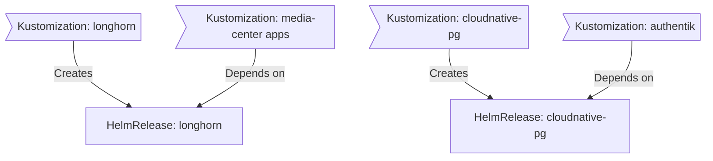

<div align="center">

### My Homelab Infrastructure 🏡
_... powered by Talos, Kubernetes and GitHub Actions_

</div>

<div align="center">

[](https://talos.dev)&nbsp;&nbsp;
[](https://kubernetes.io)&nbsp;&nbsp;
[](https://fluxcd.io)&nbsp;&nbsp;
[](https://github.com/renovatebot/renovate)

</div>

<div align="center">


</div>

---

##  Overview

This repository contains the full infrastructure-as-code and GitOps configuration for my home Kubernetes cluster. It is the single source of truth for the cluster's state, automatically managed and reconciled by FluxCD.

---

##  Kubernetes

My Kubernetes cluster is deployed with [Talos Linux](https://www.talos.dev), a minimal, immutable Linux distribution built specifically for running Kubernetes. I run a three bare-metal node cluster on Beelink Mini S12s, using [Longhorn](https://github.com/longhorn/longhorn) for distributed block storage and a QNAP NAS for NFS media storage.

### Core Components

- **Networking & Ingress**: [Cilium](https://github.com/cilium/cilium) for eBPF-based networking, [Envoy Gateway](https://gateway.envoyproxy.io) as the ingress controller implementing the Gateway API, [Cloudflared](https://github.com/cloudflare/cloudflared) for secure external ingress via Cloudflare Tunnel, and [External-DNS](https://github.com/kubernetes-sigs/external-dns) for automatic DNS record management.
- **Security & Identity**: [Authentik](https://goauthentik.io) as the SSO/OIDC provider for internal services. [Cert-Manager](https://github.com/cert-manager/cert-manager) for automated TLS. [SOPS](https://github.com/getsops/sops) for encrypted secrets in Git.
- **Observability**: [VictoriaMetrics](https://victoriametrics.com) for metrics, [Loki](https://github.com/grafana/loki) for logs, [Grafana](https://github.com/grafana/grafana) for dashboards, [Gatus](https://github.com/TwiN/gatus) for uptime monitoring.
- **Storage & Data**: [Longhorn](https://github.com/longhorn/longhorn) for distributed block storage. [CloudNative-PG](https://cloudnative-pg.io) for PostgreSQL.
- **Automation & CI/CD**: [Renovate](https://github.com/renovatebot/renovate) for automated dependency updates. [Actions Runner Controller](https://github.com/actions/actions-runner-controller) for self-hosted GitHub Actions runners.

### GitOps

[Flux](https://github.com/fluxcd/flux2) watches the `infrastructure/apps` folder and makes changes to my cluster based on the state of this Git repository.

Flux recursively searches `infrastructure/apps` until it finds the top-level `kustomization.yaml` per directory and applies all resources listed in it. That `kustomization.yaml` will generally only have a namespace resource and one or many Flux kustomizations (`ks.yaml`). Under those Flux kustomizations there will be a `HelmRelease` or other resources related to the application.

[Renovate](https://github.com/renovatebot/renovate) watches my **entire** repository looking for dependency updates. When updates are found a PR is automatically created, and when merged Flux applies the changes to the cluster.

### Directories

```sh
📁 infrastructure
├── 📁 apps       # applications
├── 📁 components # re-useable kustomize components
└── 📁 flux       # flux system configuration
```

### Flux Dependency Graph

A high-level view of how Flux orders deployments. Storage is always provisioned before workloads that depend on it.



---

##  Hardware

| Device | Num | CPU | RAM | Storage | Function |
|--------|-----|-----|-----|---------|----------|
| Beelink Mini S12 | 3 | Intel N100 (4C/4T, 3.4GHz) | 16GB DDR4 | 500GB SSD | Kubernetes nodes |
| QNAP TS-433 | 1 | ARM Cortex-A55 | 4GB DDR4 | 2× WD Red Plus 8TB | NFS media storage |
| TP-Link ER605 V2 | 1 | — | — | — | Router / firewall |
| TP-Link OC200 | 1 | — | — | — | Omada controller |
| TP-Link EAP245 | 1 | — | — | — | Wi-Fi access point |
| TP-Link TL-SG2210MP (10P PoE+) | 1 | — | — | — | Core managed switch |
| TP-Link TL-SG108E | 1 | — | — | — | Smart switch |
| TP-Link TL-SG105E | 1 | — | — | — | Smart switch |

---

##  Services

| Category | Service | Description |
|----------|---------|-------------|
| **Media** | [Jellyfin](https://jellyfin.org) | Media server |
| | [Audiobookshelf](https://www.audiobookshelf.org) | Audiobook & podcast server |
| | [Shoko](https://shokoanime.com) | Anime library manager |
| | [Sonarr](https://sonarr.tv) / [Radarr](https://radarr.video) | TV & movie management |
| | [Prowlarr](https://github.com/Prowlarr/Prowlarr) | Indexer manager |
| | [Bazarr](https://www.bazarr.media) | Subtitle management |
| | [qBittorrent](https://www.qbittorrent.org) | Torrent client |
| | [Seerr](https://github.com/seerr-team/seerr) | Media request management |
| | [Bookshelf](https://github.com/pennydreadful/bookshelf) | Book library (Hardcover metadata) |
| **Self-hosted** | [FreshRSS](https://freshrss.org) | RSS reader |
| | [Homebox](https://github.com/sysadminsmedia/homebox) | Home inventory management |
| | [Excalidraw](https://github.com/excalidraw/excalidraw) | Collaborative whiteboard |

---

_This README is a living document and will be updated as the homelab evolves._

---

##  Thanks

Thanks to all the people who donate their time to the [Home Operations](https://discord.gg/home-operations) Discord community. Be sure to check out [kubesearch.dev](https://kubesearch.dev/) for ideas on how to deploy applications or get ideas on what you could deploy.
